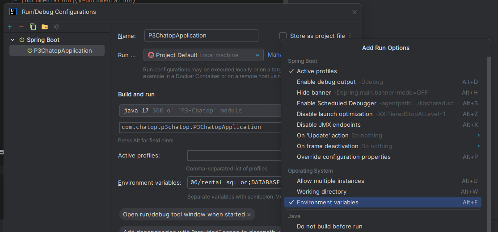
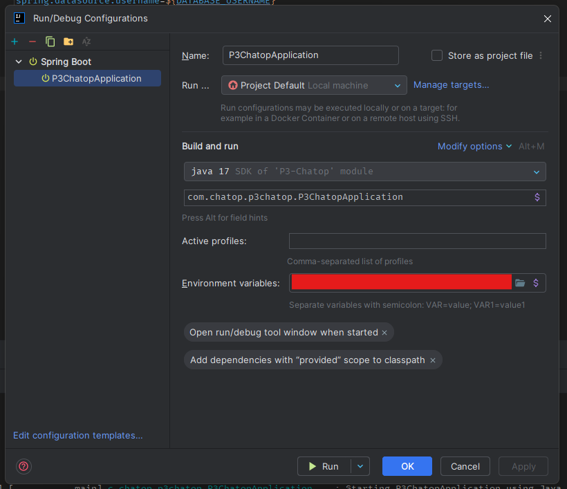
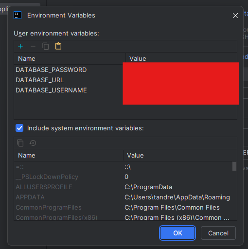

 

# 🚙 Project 3 - Develop the back-end using Spring Boot

...

## 📖 Table of Contents

- [Project](#-project)
    - [Prerequisites](#prerequisites)
    - [Starting the project](#starting-the-project)
    - [Build the project](#build-the-project)
- [Documentation](#-documentation)
    - [Architecture](#architecture)
    - [Mock Data](#models)
    - [Models](#mock-data)
    - [Library](#library)

## 📁 Project

### Prerequisites

### Configurer variable d'environement

Sur Intellij dans `Edit Configuration`

### Starting the project

1. Run `ng serve` for start the development server.
2. Navigate to `http://localhost:4200/`.

> [!NOTE]
> The application will automatically reload if you change any of the source files.

### Build the project

Run `ng build` to build the project.

> [!NOTE]
> The build artifacts will be stored in the `dist/` directory.

## ⚙️ Etape du Build

### STEP 1 - Initialisation du projet

### STEP 2 - Authentification JWT

### STEP 3 - Implémentation une route

Implémentation de la route `/auth/*`

### STEP 4 - Implémentation Swagger

Ajout de la dépendance `org.springdoc`

### STEP 5 - Implémentation des routes

### STEP 6 - Documentation Swagger

### STEP 7 - Nettoyer le code

## 📄 Documentation

### Architecture

Couche / Objectif

controller / Réceptionner la requête et fournir la réponse

service / Exécuter les traitements métiers

repository / Communiquer avec la source de données

model / Contenir les objets métiers

### Mock Data

- `assets/mock/olympic.json` folder: contains the data used in app

### Models

